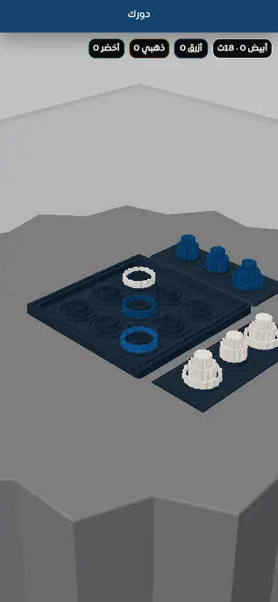

# v111 Visual Verification

Tested on 2026-07-23 from the exact branch source after the automated contract passed.

## Desktop setup

## Desktop after a legal move and AI response

## Mobile setup — 390×844 / DPR 2

## Mobile after a legal touch move and AI response

The normal player path contains no maintenance control. The separate `?debug=1` path was also verified to retain the control. No uncaught Console errors or mobile viewport overflow were observed in these tested paths.
