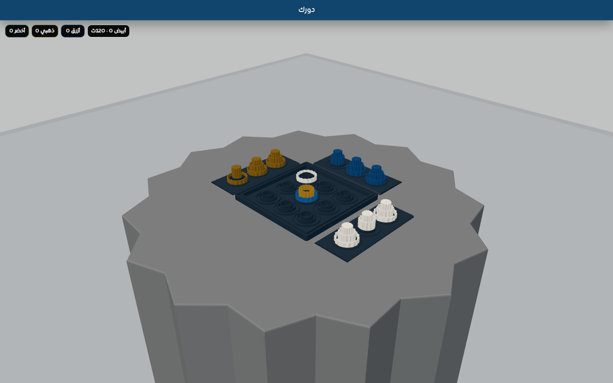
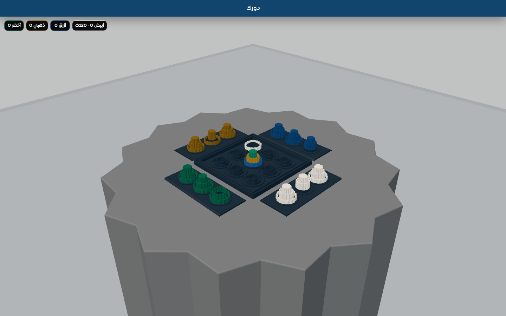
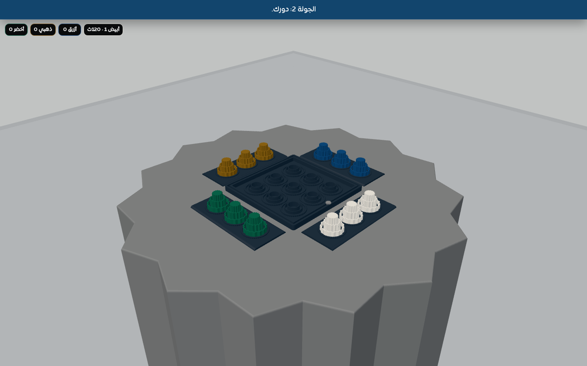
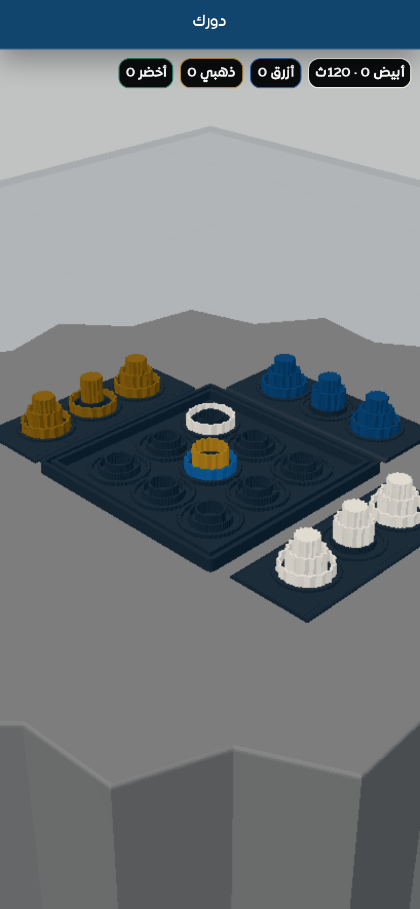
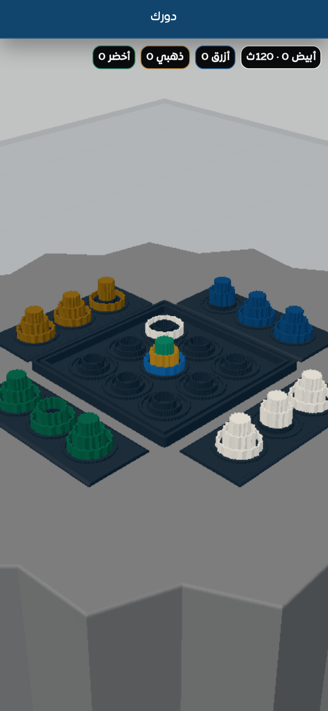
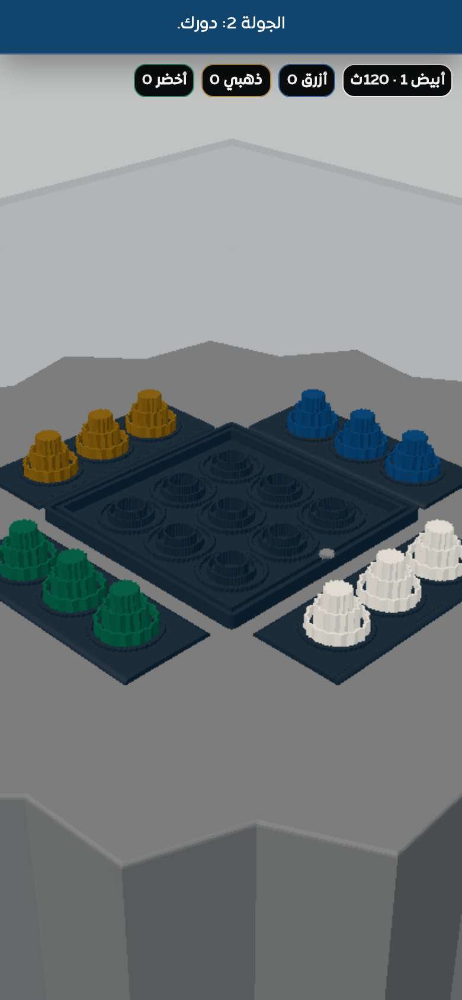

# v112 Multiplayer and Restart Verification

GitHub Actions run `30022731792` passed on desktop and mobile.

- Three-player cycle: human and two bots moved, then control returned to the human.
- Four-player cycle: human and three bots moved, then control returned to the human.
- Post-win restart: round advanced to 2, winner score advanced to 1, and board, highlights, placed pieces, winner, lock, and last-move state were cleared.
- Full reload: returned to clean color setup, preserved onboarding completion, and started a fresh four-player match at round 1 with zero scores.
- Desktop viewport: 1440×900.
- Mobile viewport: 390×844 at DPR 2.
- Browser application errors: none.

