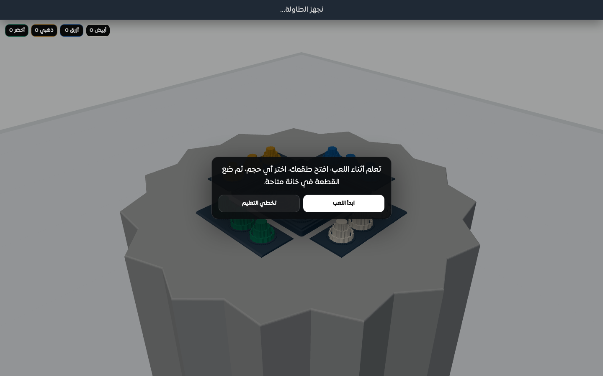
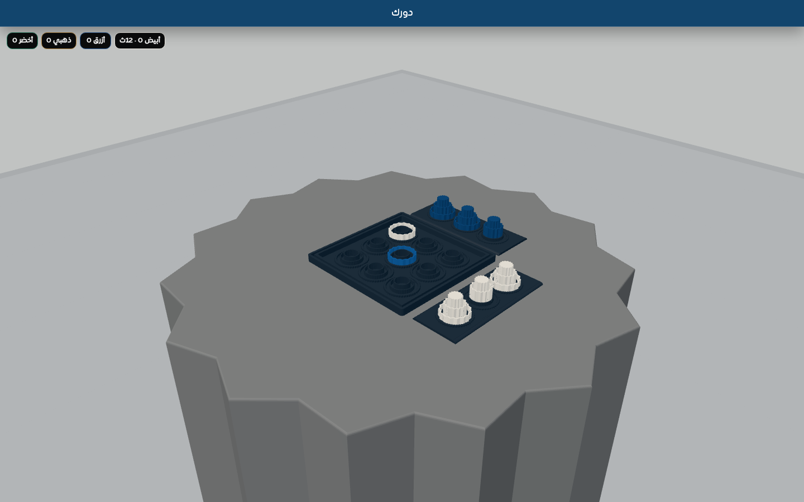
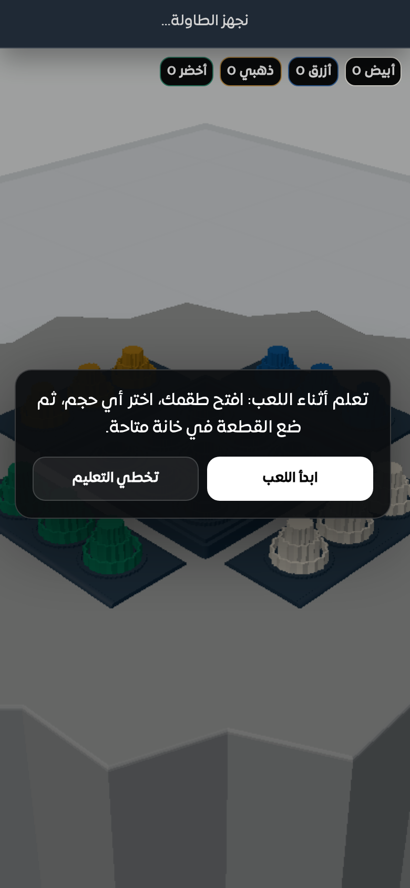
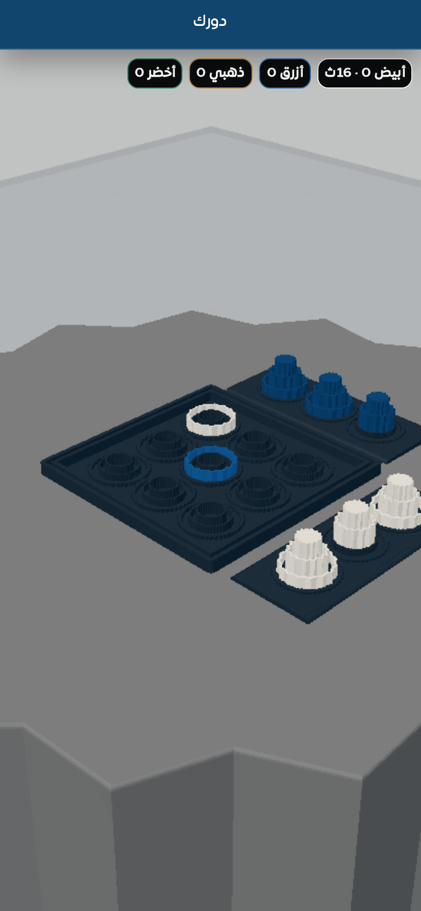

# v112 Visual Verification

- Desktop: first-time guided move, skip, and returning-player paths passed.
- Mobile 390×844 / DPR 2: the same paths passed with touch input and no viewport overflow.
- No application Console or page errors were observed.
- Software-renderer ReadPixels performance warnings from CI screenshot capture are ignored as environment-only diagnostics.

