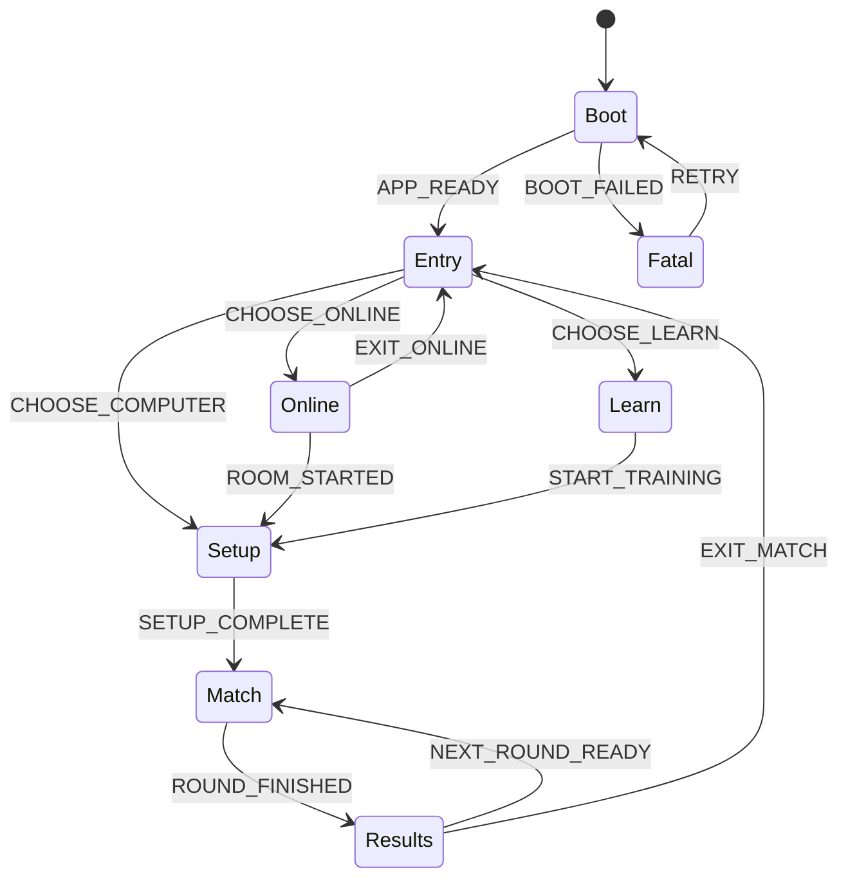
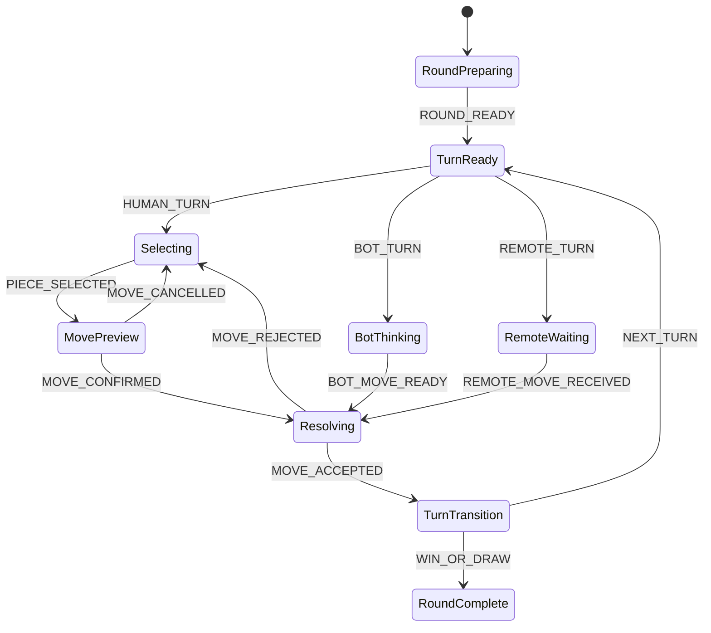

# Hierarchical State Machine

## الهدف

منع اعتماد التجربة على DOM classes أو timers أو polling لاكتشاف ما يحدث. كل انتقال يجب أن يبدأ بحدث، يمر عبر Guard، وينتهي بحالة معروفة وآثار جانبية محددة.

## المستوى الأعلى



## الحالات العليا

### `Boot`

يدير تحميل الأصول، تهيئة المشهد، قراءة التفضيلات، وفحص جلسة سابقة.

الأحداث:

- `APP_START`
- `ASSETS_READY`
- `SESSION_FOUND`
- `SESSION_RESTORED`
- `BOOT_FAILED`

### `Entry`

يدير الجدار الرئيسي فقط. لا يفتح الأونلاين أو الإعداد بنفسه؛ يصدر حدث اختيار.

الأحداث:

- `HOVER_MODE`
- `SELECT_MODE`
- `ENTRY_TRANSITION_FINISHED`
- `OPEN_SETTINGS`

### `Online`

حالات فرعية:

```text
browse → create → waiting → starting
      ↘ join ────────↗
```

أحداث أساسية:

- `ROOMS_REFRESH`
- `CREATE_ROOM`
- `PREVIEW_ROOM`
- `JOIN_ROOM`
- `PLAYER_JOINED`
- `PLAYER_LEFT`
- `ROOM_COMPLETE`
- `ROOM_CANCELLED`
- `NETWORK_LOST`
- `NETWORK_RESTORED`

### `Setup`

```text
locked → choose-color → choose-players/rounds → confirming → complete
```

يُسمح بتخطي خطوات يعرفها مسار الأونلاين مسبقًا، لكن لا تتغير أسماء الحالات.

### `Match`



### `Results`

حالات فرعية:

- `highlighting`
- `round-summary`
- `waiting-rematch`
- `match-summary`
- `exiting`

## Events الأساسية

```text
APP_READY
CHOOSE_MODE
CAMERA_ARRIVED
SETUP_STEP_COMPLETED
TURN_STARTED
OPEN_TRAY
SELECT_SIZE
PICK_PIECE
POINT_AT_ZONE
CONFIRM_MOVE
CANCEL_MOVE
MOVE_ACCEPTED
MOVE_REJECTED
TURN_EXPIRED
WIN_DETECTED
DRAW_DETECTED
REQUEST_REMATCH
ALL_PLAYERS_READY
NETWORK_LOST
NETWORK_RESTORED
EXIT
```

## Guards

- `isHumanTurn`
- `isRoomReady`
- `isSetupComplete`
- `isLegalMove`
- `hasPieceRemaining`
- `isAnimationIdleOrInterruptible`
- `canOpenOverlay`
- `canLeaveSafely`
- `isSessionCurrent`

## Effects

الحالة لا تنفذ Three.js أو Fetch مباشرة. تنتج Effects:

```text
camera.goTo(pose)
motion.play(id)
ui.open(screen)
ui.close(screen)
game.apply(command)
network.send(command)
audio.play(cue)
storage.save(snapshot)
```

كل Effect يعيد حدث نجاح أو فشل، مثل:

- `CAMERA_ARRIVED`
- `MOTION_FINISHED`
- `NETWORK_COMMAND_ACCEPTED`
- `NETWORK_COMMAND_REJECTED`

## سياسة المقاطعة

- الانتقال من جدار إلى طاولة يمكن إلغاؤه فقط قبل نقطة الالتزام.
- حركة وضع القطعة لا تقاطع بعد قبول الخادم للحركة.
- فتح الإعدادات لا يغير Match State؛ يضيف Overlay State.
- فقد الاتصال يجمّد الإدخال، لكنه لا يغير اللوحة حتى تصل حالة موثوقة.
- Resize لا يغير State؛ يطلب إعادة حساب Pose الحالية.

## تعريف الإنجاز لأي حالة

لا تعتبر الحالة مكتملة حتى يوجد:

1. Event للدخول والخروج.
2. Guard واضح.
3. Camera Pose أو قرار عدم تحريك الكاميرا.
4. Input policy.
5. Reduced Motion behavior.
6. Timeout/error behavior.
7. Test واحد على الأقل للانتقال الأساسي والانقطاع.